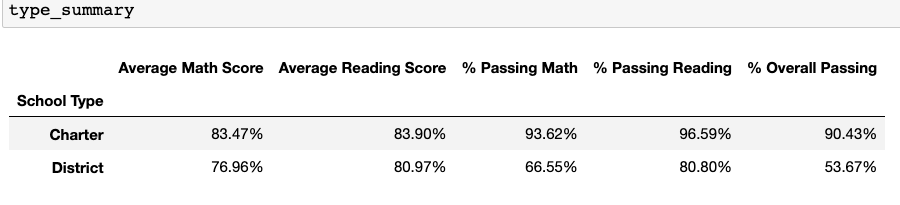
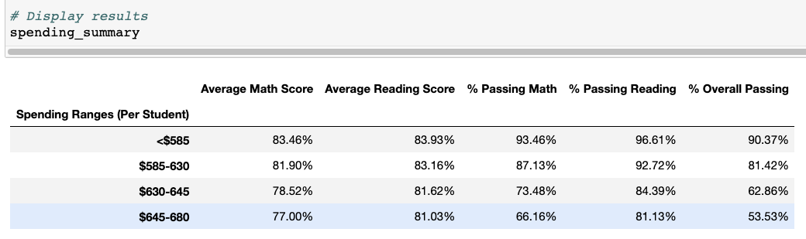
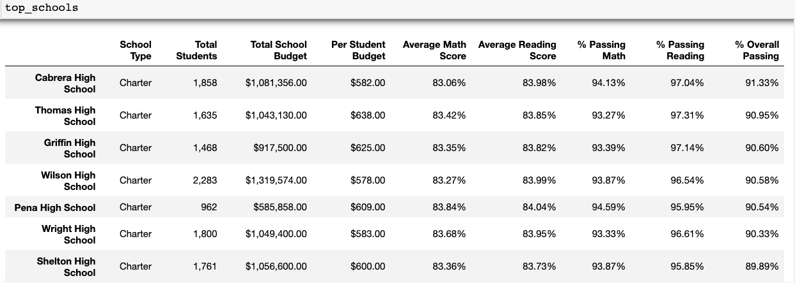

# Pandas Challenge

Aim of this challenge is to aid school board and mayor of a district make key strategic decisions regarding future school budgets and priorities. 

The task was to analyze district-wise standardized test results of students and draw factual conclusions about the trends observed in school performances. 

# PyCity School Analysis

- As Charter Schools have more flexibility in adopting advanced learning programs, it is indicative in the overall passing rate of school types. Charter Schools have an ***increase of 36.76%*** in overall passing rate in comparison with District Schools.

   *Note: Overall Passing % for Charter Schools and District Schools is 90.43% and 53.67% respectively*

    

- Small and Medium schools (with students ranging from *1000 <= 2000*) fare considerably better in comparison to Large schools (with students ranging from 2000 <= 5000).   There is at least a ***30% increase in overall passing rate*** between Large and Small/Medium schools.

    *Note: Overall Passing % for Small, Medium and Large Schools is 89.88%, 90.62% and 58.29% respectively*

    

- Ironically, a lower spending budget per student indicates students faring exceptionally well. From the spending summary it is evident that a ***spending budget of < $585 yeilds an overall passing rate of 90.37%***, whereas increasing the budget shows a steady decline in the overall passing rate. 

    The worst performance is student ***spending budget ranging between $645-680 (with an overall passing rate of 53.53%)***

    *Note: Overall Passing Rate for students is,   <$585: 90.37%, $585-630: 81.42%, $630-645: 62.86% and $645-680: 53.53%*
    
    

- Top performing schools are consistenly Charter Schools, while the bottom performing schools are District Schools.   ***Charter Schools have an overall passing rate of >= 89%***, while   ***District Schools have an overall passing rate of <= 54%***

    
    

---

## How to Install and Run the script

To run this script:
1. Copy the git link in your local git repository
2. Ensure *Resources* directory and *PyCitySchools.ipynb* file are present
3. Ensure the respective csv datasets are present in the *Resources* folder
4. Run the script using **Jupyter Notebook** from *PyCitySchools* directory and view results
5. Be sure to run the entire script using *Restart & Run All option* from *Kernel* in *Jupyter Notebook* to get error free results
6. Or, you could alternatively run each block of code individually starting from the very top 
7. In additon, you could change the csv dataset containing the same columns in *Resources* folder and run the code to see the results

---
## Credits

To write this script, I used the starter code provided and discussed the school summary value calculations with my TAs.   

They helped me write a small portion of the logic to calculate some group by objects. I also discussed a small syntax error with my peer, who helped me correct it and get the desired school summary dataframe.  

Majority of the work went into understanding the various errors I encountered. I learnt a lot about creating dataframes using group by series and formatting errors when attempting arithmetic manipulation on data (with datatype: object)

---
## References

https://sparkbyexamples.com/pandas/pandas-map-function-explained/

https://www.methodschools.org/blog/5-differences-between-charter-and-public-schools

https://www.datacamp.com/tutorial/markdown-in-jupyter-notebook

https://docs.github.com/en/get-started/writing-on-github/getting-started-with-writing-and-formatting-on-github/basic-writing-and-formatting-syntax

https://builtin.com/data-science/pandas-show-all-columns

https://pandas.pydata.org/docs/reference/api/pandas.set_option.html

